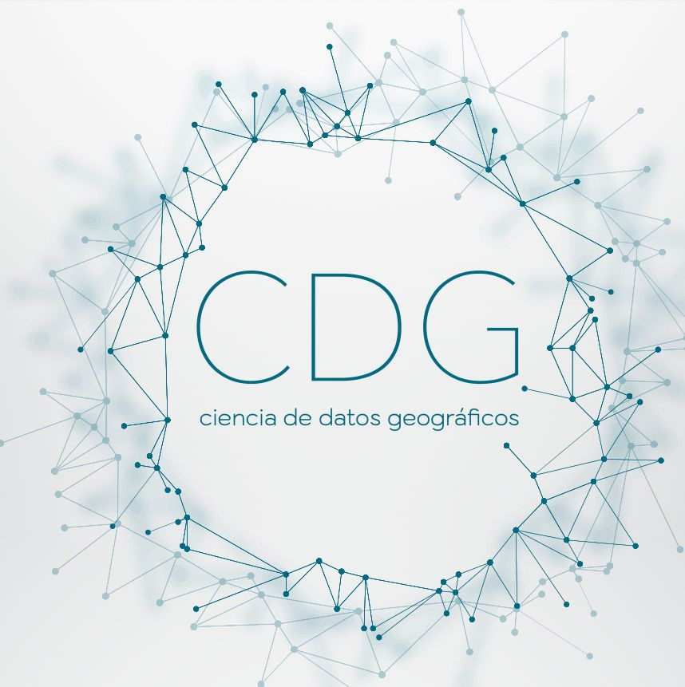
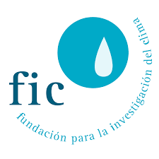

## Información práctica

### Profesorado

{.table .table-condensed .table-striped .text-left}
       |      |     |     
--------------------|-------------------|------------------|------------------
[Marcos Rodrigues](http://geografia.unizar.es/personal/marcos-rodrigues-mimbrero) | Universidad de Zaragoza        | <a href="mailto:rmarcos@unizar.es" title="email"><i class="fa fa-envelope"></i></a> &nbsp; <a href="https://github.com/rmarcosgit" title="GitHub"><i class="fa fa-github"></i></a> &nbsp; <a href="https://www.google.com/url?sa=t&source=web&rct=j&opi=89978449&url=https://twitter.com/krestatheklown" title="Twitter"><i class="fa fa-twitter"></i></a> | Director
[Roberto Serrano](http://geografia.unizar.es/personal/roberto-serrano-notivoli) | Universidad de Zaragoza | <a href="mailto:roberto.serrano@unizar.es" title="email"><i class="fa fa-envelope"></i></a> &nbsp; <a href="https://github.com/rsnotivol" title="GitHub"><i class="fa fa-github"></i></a> | Codirector
[Aitor Ameztegui](https://amezteguilab.wordpress.com/) | Universitat de Lleida | <a href="mailto:aitor.ameztegui@udl.cat" title="email"><i class="fa fa-envelope"></i></a> &nbsp; <a href="https://github.com/ameztegui" title="GitHub"><i class="fa fa-github"></i></a> &nbsp; <a href="https://x.com/multivac42" title="Twitter"><i class="fa fa-twitter"></i></a> |
[Samuel Esteban](http://geografia.unizar.es/personal/samuel-esteban-rodriguez) | Universidad de Zaragoza | <a href="mailto:mailto:sestebanr@unizar.es" title="email"><i class="fa fa-envelope"></i></a> &nbsp; <a href="" title="GitHub"><i class="fa fa-github"></i></a> |  
[Pere Gelabert](https://pjgelabert.netlify.app/) | Universitat de Lleida | <a href="mailto:perejoan.gelabert@udl.cat" title="email"><i class="fa fa-envelope"></i></a> &nbsp; <a href="https://github.com/scsibs" title="GitHub"><i class="fa fa-github"></i></a>  &nbsp; <a href="https://x.com/pere_gelabert?lang=es" title="Twitter"><i class="fa fa-twitter"></i></a> | 
[Víctor Granda](https://www.creaf.cat/es/sobre-nosotros/nuestra-gente/victor-granda-garcia) | CREAF |  <a href="mailto:v.granda@creaf.uab.cat" title="email"><i class="fa fa-envelope"></i></a> &nbsp; <a href="https://github.com/MalditoBarbudo" title="GitHub"><i class="fa fa-github"></i></a> &nbsp; <a href="https://x.com/malditobarbudo?lang=es" title="Twitter"><i class="fa fa-twitter"></i></a> | 
[Martín de Luis](http://geografia.unizar.es/personal/martin-de-luis-arrillaga) | Universidad de Zaragoza | <a href="mailto:mdla@unizar.es" title="email"><i class="fa fa-envelope"></i></a> |  
[Dhais Peña](http://geografia.unizar.es/personal/dhais-pena-angulo) | Universidad de Zaragoza | <a href="mailto:dpa@unizar.es" title="email"><i class="fa fa-envelope"></i></a>  &nbsp; <a href="https://x.com/dhaispa?lang=es" title="Twitter"><i class="fa fa-twitter"></i></a> |  
[Dominic Royé](https://www.linkedin.com/in/dominicroye) | Fundación para la Investigación del Clima | <a href="mailto:dominic.roye@ficlima.org" title="email"><i class="fa fa-envelope"></i></a> &nbsp; <a href="https://github.com/dominicroye" title="GitHub"><i class="fa fa-github"></i></a>&nbsp; <a href="https://x.com/dr_xeo?lang=es" title="Twitter"><i class="fa fa-twitter"></i></a> |   |
  

### Bibliografía

Algunos ejemplos de bibliografía

{.table .table-condensed .table-striped .text-left}
      |  |  
-----------|---------------------------------|----------------------------------
[R for Data Science](http://r4ds.had.co.nz/) | Grolemund, Wickham | O'Reilly, 2016
[Data visualization: a practical introduction](https://kieranhealy.org/publications/dataviz/) | Healy | O’Reilly, 2019
[Fundamentals of Data Visualization: A Primer on Making Informative and Compelling Figures](https://serialmentor.com/dataviz/) | Wilke | O’Reilly, 2019
[The Functional Art: An introduction to information graphics and visualization](http://www.thefunctionalart.com/) | Cairo | New Riders Publishing, 2012
[The truthful Art: Data, Charts, and Maps for Communication](https://www.amazon.es/Truthful-Art-Data-Charts-Communication/dp/0321934075) | Cairo | New Riders Publishing, 2016
[Making data visual: a practical guide to using visualization for insight](https://www.amazon.com/Making-Data-Visual-Practical-Visualization/dp/1491928468) | Fisher , Meyer |  O’Reilly, 2019
[Good Enough Practices in Scientific Computing](https://journals.plos.org/ploscompbiol/article?id=10.1371/journal.pcbi.1005510) | Wilson et al. | PLoS Computational Biology 2016 

### Entidades participantes

